# Discover the Flavours of London

## Mockup

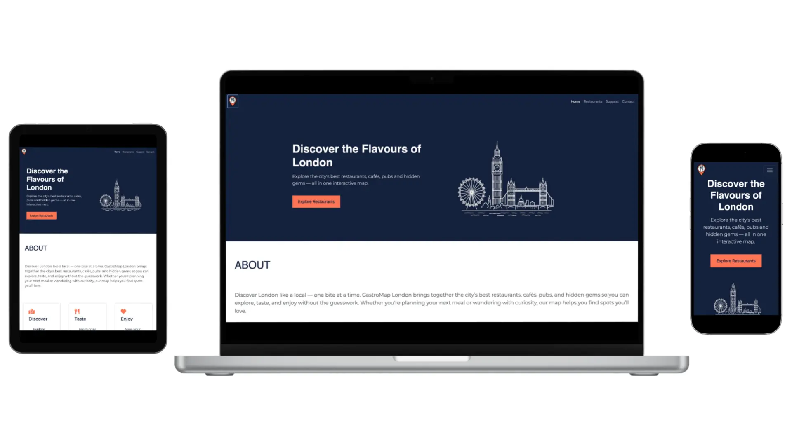

Discover the Flavours of London is a concept website project designed to highlight key front-end development skills such as HTML, CSS, and JavaScript integration. The website aims to provide users with an interactive and informative platform to discover the best restaurants and attractions across London.

It focuses on usability, responsive design, and dynamic content generation, allowing users to explore categories, view locations on an interactive map, and connect through a contact form.
The project is educational and portfolio-based, not linked to a real business or tourism organization.

The purpose of this project is to demonstrate how a simple city guide website can deliver dynamic functionality using JavaScript and APIs. The site connects users with local food and culture through clean UI design and interactive map integration. It showcases web development skills such as DOM manipulation, data rendering, and responsive layouts.

**Project Focus**

- Creating a responsive and accessible design.
- Implementing interactive JavaScript features like filtering, searching, and Google Maps API integration.
- Practicing data management with JavaScript arrays or JSON.
- Providing an engaging user experience with a clear layout and smooth navigation.

## Business Goals

- Present London as a vibrant culinary destination.
- Provide useful restaurant and attraction recommendations.
- Demonstrate use of interactive web components and APIs.

## User Goals 

- Easily find popular restaurants and attractions in London.
- View restaurant locations on an interactive Google Map.
- Contact the site to suggest new locations or report outdated information.

## Strategy 

The strategy focuses on creating a visually engaging and intuitive website that allows users to navigate and interact with restaurant data efficiently. The design combines simplicity and functionality, ensuring smooth transitions between pages and mobile responsiveness. JavaScript features will enhance interactivity and create a real-world application feel.

## Scope

**Must have**

- Homepage with a hero section and “Explore Now” button.
- Restaurant/Attraction listing page with filter and search functionality.
- Interactive Google Map integration using API.
- Suggest form with JavaScript form validation.
- Responsive design (mobile-first approach).

**Nice to Have**

- Save favourite restaurants using localStorage.
- Animated transitions when new cards appear.
- Dark/light mode toggle.
- Weather widget using OpenWeather API.

## Structure

The website structure guides users from curiosity to exploration:

### 1. Homepage:

- Hero image of London.
- Overview of the project and categories (Restaurants, Coffee, Pub).
- “Explore Restaurants” button linking to the restaurants page.

### 2. Restaurants page:

- Google Map displaying markers for each restaurant.
- Filter bar.
- Search bar.
- Dynamically generated restaurant cards with images, names, ratings, and short descriptions.

### 3. Suggest Restaurant Form:

- Simple form for user suggest.
- JavaScript form validation with Restaurants suggested.

### 4. Footer:

- Copyright, social links, and contact details.

## Information Architecture

**Navigation:**

- Sticky top navigation bar with:

Home | Restaurants | Suggest | Contact

**Page Hierarchy:**

- Homepage: Introduction, CTA.
- About: Website's proposal and interactive cards.
- Restaurants: Interactive list + Google Map.
- Form: Suggestion restaurants form.
- Contact: Social media and email address.

**Interaction:**

- Filters and search powered by JavaScript.
- Map updates dynamically when users click “View on Map.”
- Smooth scrolling and hover effects for better engagement.

## Skeleton

**Priority Content:**

- High Priority:

1. Explore Restaurants CTA.
2. Google Map.
2. Interactive restaurants cards with filter and search bar.

- Medium Priority

1. Suggest a restaurant form.

- Low Priority

1. Footer: contact, social links and privacy policy.


## User Stories

### User Story 1 — The Curious Tourist

**Story:**

As a visitor exploring London for the first time, I want to see a list of restaurants and attractions with images and short descriptions, so that I can choose places that interest me easily.

**Acceptance Criteria:**

- Homepage introduces London and links to the restaurant page via “Explore Now.”
- Restaurant cards show name, image, short description, and “View on Map.”
- Cards load dynamically from JavaScript data.
- Layout is responsive across devices.

### User Story 2 — The Food Lover

**Story:**

As a food enthusiast, I want to filter restaurants by category (like Italian, Café, Pub, Desserts) and see their locations on a map, so I can quickly find what I’m craving nearby.

**Acceptance Criteria:**

- Filter bar updates visible restaurant cards dynamically.
- Search bar filters by name or keyword.
- Google Map updates markers according to filters.
- “View on Map” centers the map on the selected restaurant.

### User Story 3 — The Local Sharer

**Story:**

As a London resident, I want to send suggestions or corrections through a contact form, so I can help improve the guide for other users.

**Acceptance Criteria:**

- Contact form includes name, email, and message fields.
- JavaScript validation checks that all fields are filled and email is valid.
- Success message appears when form is submitted correctly.
- Optional embedded map or London image displayed on the contact page.

## Features 

**Navigation Bar**

- Smooth Navigation with navbar fixed-top and anchor-links to key section. Quick section to Restaurants, Suggest Form, and Contac sections.


**Hero & Information Sections**

- Hero section with call-to-action to explore restaurants.
- About section explaining the purpose and benefits of the platform.


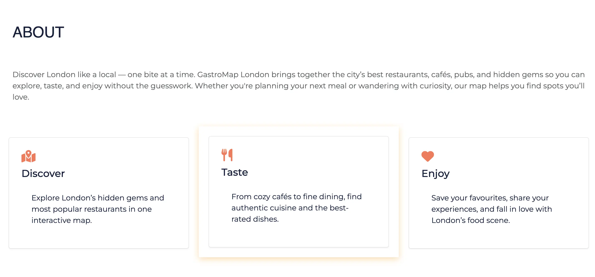

**Interactive Google Maps**

- Integrated Google Maps API to display restaurant locations across London. "Viwe on Map" buttons link restaurants cards directly to their map markers and visual map container for easy exploration of venues by location.

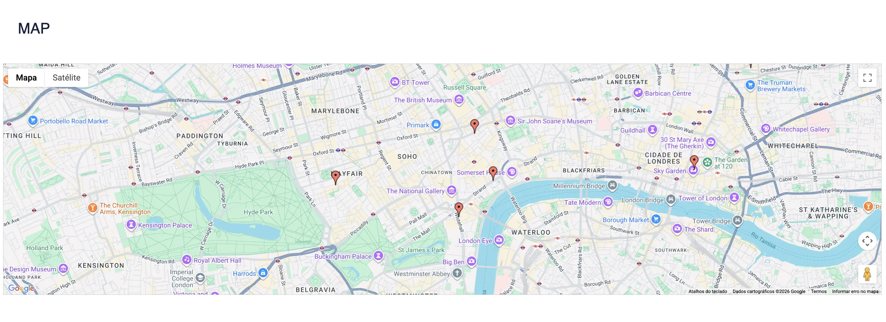

**Filter & Search functionality**

- Category filter buttons (All, Restaurant, Coffee Shop, Pub).
- Live text search to quickly find restaurants by name.
- Combined filtering and searching for better user experience.

**Restaurant Listing**

- Responsive restaurant cards with images, names, categories, and star ratings.
- Clean, card-based layout for easy browsing.

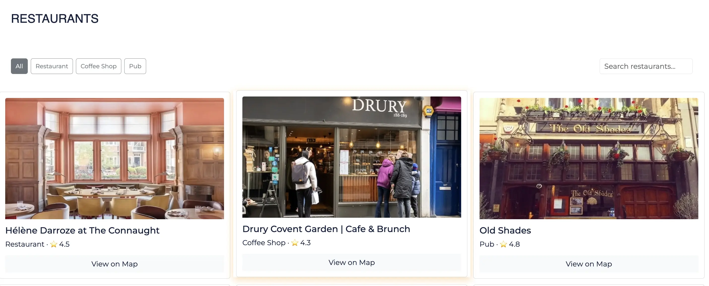
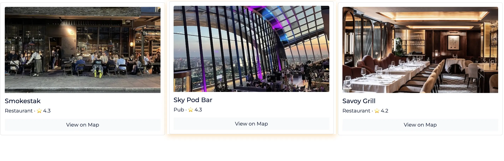

**Suggest a Restaurant Form**

- User submission form to suggest new venues.
- Captures restaurant name, rating, category, and map availability.
- Dynamic display of submitted suggestions.

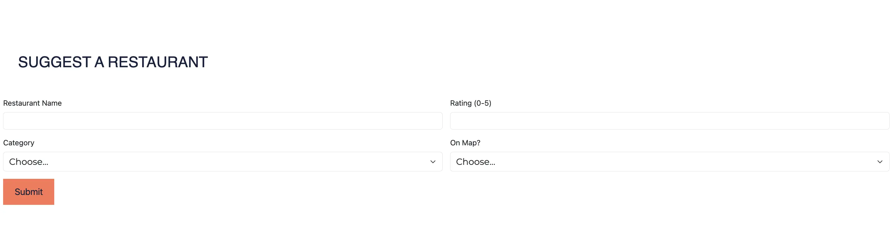
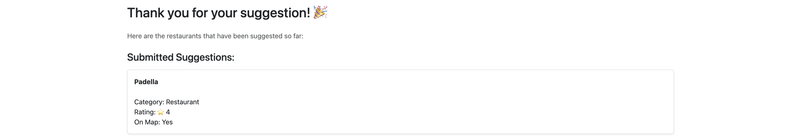

**Social & Contact Integration**

- Footer with contact email and social media icons.


## Tecnologies Used

- HTML5
- CSS3 (Custom CSS + CSS Variables)
- Bootstrap 5.3
- JavaScript (ES11)
- Google Maps JavaScript API
- Font Awesome Icons
- Google Fonts

## Manual Testing

The website was manually tested across different browsers and screen sizes to ensure functionality, responsiveness, and usability.

**Navigation**

- Navbar links scroll to correct sections
- Mobile navbar collapses after link click
- Logo redirects to Home

**Restaurant Filters & Search**

- Filter buttons correctly show/hide restaurants
- Active filter state updates correctly
- Search input filters restaurants by name
- Search clears active filter highlighting

**Google Maps**

- Map loads correctly on page load
- "View on Map" buttons: 
1. Scroll to map section
2. Center map on correct restaurant
3. Animate and highlight correct marker
4. Open info window with correct image and details

**Suggest a Restaurant Form**

- Form prevents empty submissions
- Name length validation works
- Rating range validation (0–5) works
- Data is saved to localStorage
- User is redirected to confirmation page

**Responsive Design**

- Tested on:
1. Desktop (Chrome, Edge)
2. Tablet view (DevTools)
3. Mobile view (DevTools)
- Layout adjusts correctly
- Cards and map resize appropriately

## User Stories Testing

**User Story 1 — The Curious Tourist**

- Verified restaurant cards render from the JavaScript restaurants array.
- Confirmed images and descriptions display correctly on desktop and mobile.
- Tested “Explore Now” button navigation.

**User Story 2 — The Food Lover**

- Clicked each filter button and confirmed only matching cards are shown.
- Typed into the search bar and confirmed live filtering by name.
- Clicked “View on Map” and verified map centers and marker animates

**User Story 3 — The Local Sharer**

- Submitted form with empty fields and confirmed validation errors.
- Submitted form with valid data and confirmed success message.
- Verified optional map/image loads on the contact page

## Automated Testing with Lighthouse

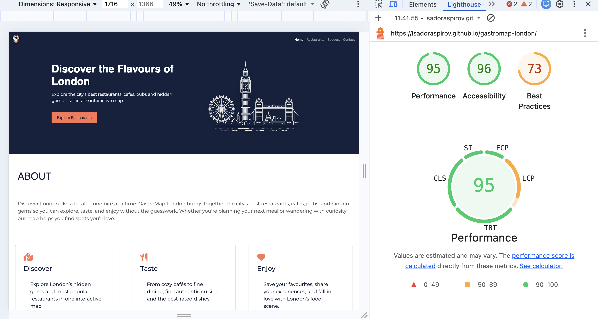

## HTML, CSS and JShint validation

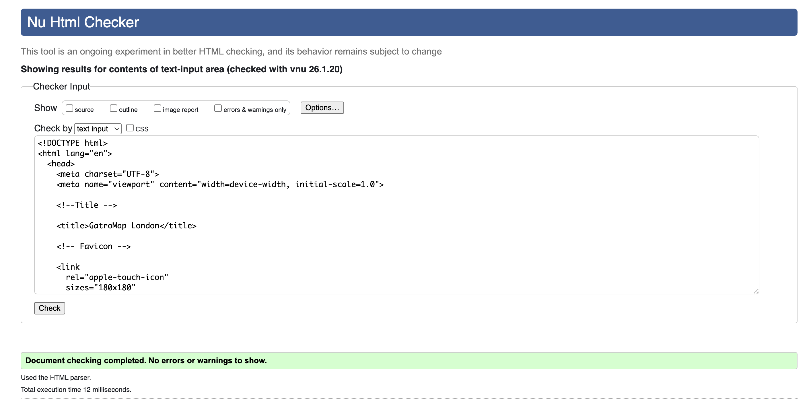
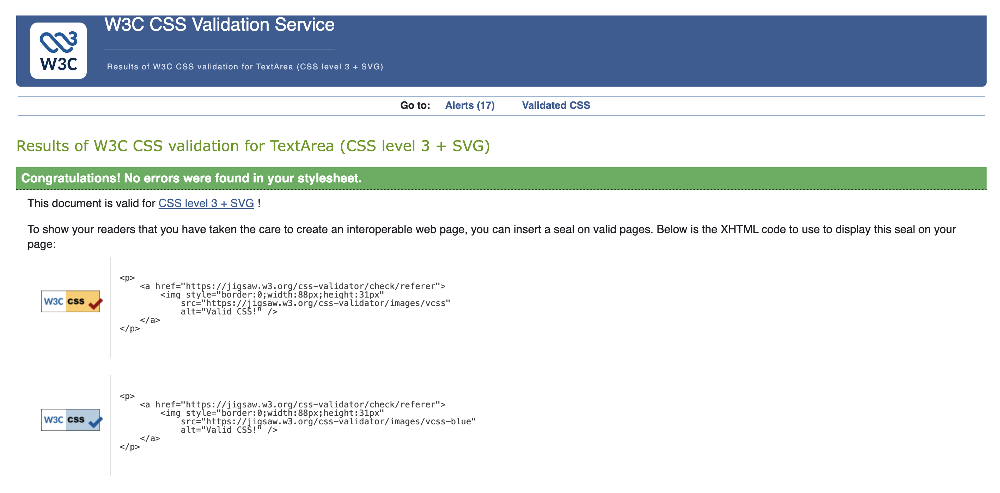
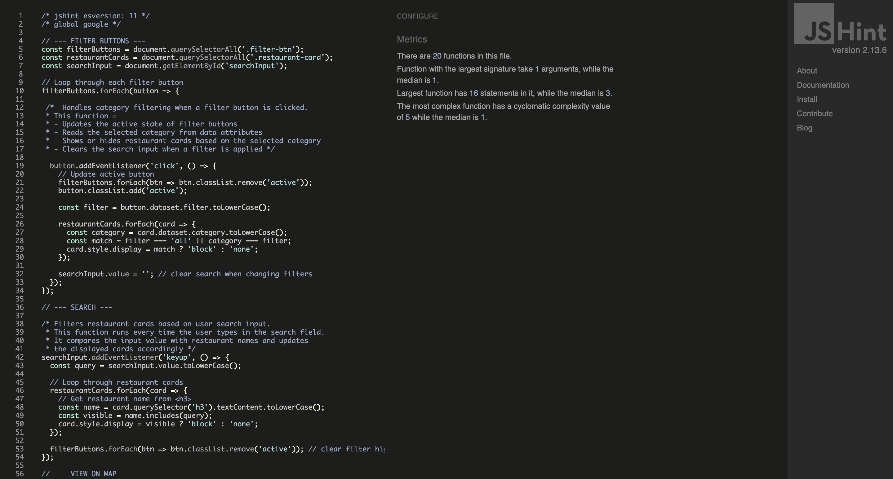

## Functionality

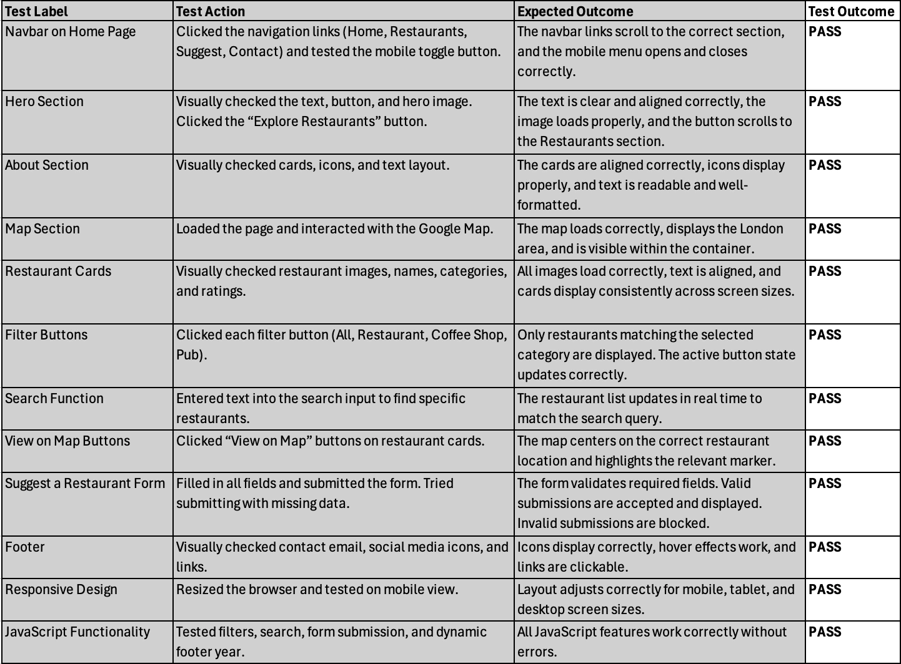

**Browser Compatibility**

Verified that the website works correctly on Chrome, Firefox, and Edge/Safari.

**Responsiveness**

Tested the application on a wide range of screen sizes, from very small devices.

## Known Issues

- Third-party cookie warnings from Google Maps in browser dev tools (expected and not project errors).
- API key exposure in development (should be restricted in production).

## Deployment

This project is hosted on GitHub Pages, a free service that publishes websites directly from a GitHub repository.

**Steps to deploy:**

1. Open the repository for this project on GitHub.
2. Click the Settings tab at the top of the page.
3. From the left-hand menu, under Code and automation, select Pages.
    In the Build and deployment section:
    Source → Deploy from a branch
    Branch → main
    Folder → / (root)
4. Click Save.
5. Return to the Code tab and wait a few minutes while GitHub builds and publishes the site.
6. Once the process is complete, go to the Environments section on the right-hand side of the repository page.
7. Click github-pages, then select View deployment to open the live site.

### Getting the Code onto Your Computer (Cloning and Forking)

To make updates or changes to the website, you need a copy of the code on your computer. There are two main ways to do this: **Cloning** and **Forking**.

#### Cloning

- Cloning means you make a direct copy of the project’s repository to your computer.  
- When you clone, your copy is linked to the original repository.  
- Any changes you make and push will be sent to the original repository for approval.  
- This method is best if you are directly involved with the project and want to contribute changes that will be merged into the original code.

**How to clone the repository:**

1. On the GitHub project page, click the green **Code** button.  
2. Copy the URL (`https://github.com/isadoraspirov/private-chef`).  
3. Open your computer’s terminal or command prompt.  
4. Type:  
   ```bash
   git clone https://isadoraspirov.github.io/gastromap-london/
5. Press Enter. This downloads the project files to your computer.

#### Forking

- Forking means you create your own copy of the repository under your GitHub account.
- Your fork is independent, so you can make changes without affecting the original project.
- If the original project changes, GitHub will notify you, and you can update your fork with those changes if you want.
- This is ideal if you want to customize the project or work on it independently.

**How to fork the repository:**

- On the GitHub project page, click the Fork button at the top right.
- This creates a copy under your GitHub account.
- Follow the cloning steps above but use the URL of your forked repository.

### Making Changes and Updating GitHub

After cloning or forking and cloning, follow these steps to make changes and update the repository:

1. Open the project folder on your computer.  
2. Make the changes you want using your code editor.  
3. Save the files.  
4. Open your terminal/command prompt and navigate to the project folder.  
5. Run:  
   ```bash
   git add .
   git commit -m "Describe your changes here"
   git push

### Automatic Deployment

Any changes pushed to the **main** branch on GitHub will automatically update the live website. This means once you push your changes, GitHub Pages will rebuild and republish the site without needing any extra steps.

### Acknowledgements

Thanks to my mentor, Brian Macharia for the guidance, feedback, and support that helped me complete this project.


